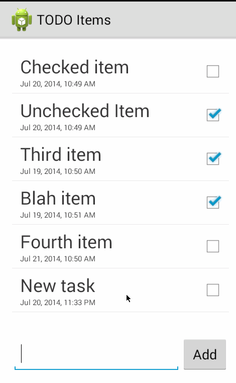

Android TODO List
=================

This is an application for maintaining a TODO list. It has been heavily extended from the project supplied to us more or less in copy and paste form during the two-hour CodePath session. Extensions include:

* switched to SQLite for persistent storage;
* factored out TODO items and the item list into separate model classes;
* added a Date to TODO items;
* created a custom layout for list view cells, which displays both the TODO's title and the relevant date, appropriately localised as per the user's selected calendar and time zone;
* added editing of the date (both day/month/year and hour/minute);
* added a checkbox to indicate whether a task has been completed, which can be toggled from the edit screen or from the list view.

Time spent: 6 hours plus two-hour session

# Completed user stories

* [x] Required: add a task
* [x] Required: remove a task
* [x] Required: edit a task
* [x] Additional: persistence of list between launched
* [x] Additional: added dates and times for tasks
* [x] Additional: added a 'done' checkbox for tasks

# Notes

There are two simple activities, one adaptor and a couple of model files. The CodePath TODO tutorial strongly influenced the main activity, with the Rotten Tomatoes tutorial being a source of inspiration for the adaptor. The two model classes — a TODO item and a TODO list — were, like the edit activity, self-written.

I factored out the list itself to a model object; it inherits directly from `SQLiteOpenHelper` which may not be ideal — it enshrines the idea there'll be only one of them. It's a singleton so that assumption has flowed deeper into the project. A custom adaptor acts both to surrender all list maintenance to the TODOList object and to provide my custom cell layout.

# Add task walkthrough

# Remove task walkthrough

# Edit task walkthrough

# Persistence walkthrough

# Toggle done walkthrough
