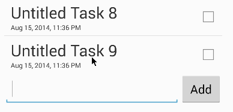
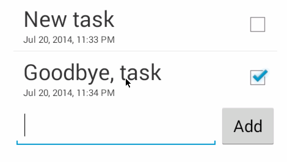
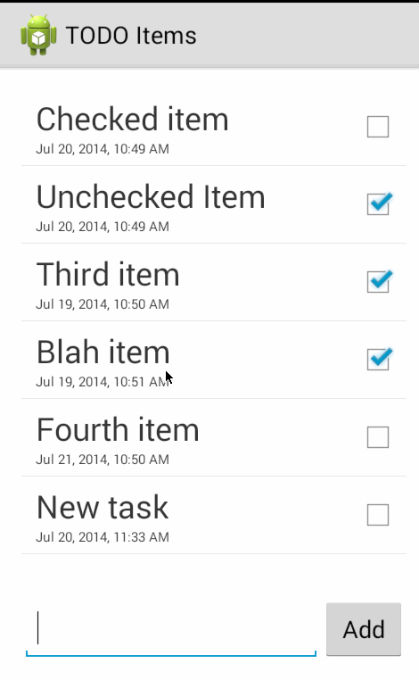

Android TODO List
=================

This is an application for maintaining a TODO list. It was extended from the project supplied to us more or less in copy and paste form during the two-hour CodePath session.

Time spent: 2 hours plus two-hour session

# Completed user stories

* [x] Required: add a task
* [x] Required: remove a task
* [x] Required: edit a task
* [x] Required: persistence of list between launched

# Notes

There are two very simple activities, one of which largely came from the CodePath tutorial and the second was self-written in order hopefully to evidence my suitability for the eight-week Android course.

I factored out the list itself to a model object as I was unaware until later that activities can return results and falsely assumed each would need to communicate with the model. However my model it doesn't encapsulate its data particularly well owing to my inexperience with adaptors.

# Add task walkthrough

# Remove task walkthrough

# Edit task walkthrough

# Persistence walkthrough
